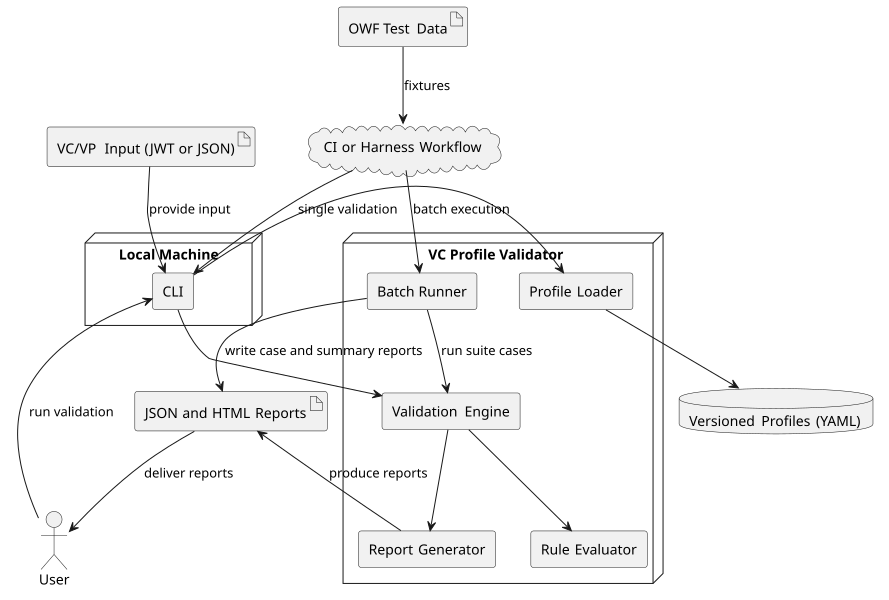
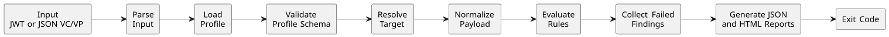

# Technical Overview

This document is the canonical technical overview for the VC Profile Validator. It describes the current architecture, validation flow, data artifacts, outputs, and extension points as implemented in the repository.

## Purpose

VC Profile Validator is a profile-driven validation tool for Verifiable Credentials (VCs) and Verifiable Presentations (VPs). It evaluates credential payloads against versioned YAML profiles and produces machine-readable reports suitable for local use, CI pipelines, and harness-oriented batch runs.

## Goals

- Deterministic rule evaluation for identical inputs
- Explainable findings with stable structure
- Separation between profile definitions and execution logic
- CLI-friendly execution for single-item and batch validation
- Extensibility through new profiles, rules, and output serializers

## Non-Goals

- Credential issuance
- Wallet or SDK implementation
- Production compliance certification
- Live DID resolution or network interaction

## Supported Inputs

The current implementation accepts:
- JWT VC/VP from file input
- JWT VC/VP from inline string input
- JSON VC/VP from inline string input
- JSON VC/VP from stdin

The engine itself receives a decoded payload object. JWT parsing and JSON parsing are handled by the CLI before invoking the validation engine.

## High-Level Architecture

The system is organized into small modules with clear responsibilities:

- **Profile Loader**: loads YAML profiles, validates them against the profile schema, and checks version alignment with the profile bundle path.
- **Rule Evaluator**: resolves JSONPath-like selectors and evaluates supported rule primitives.
- **Validation Engine**: resolves the validation target, normalizes payloads, invokes rule evaluation, and builds failed findings.
- **Report Generator**: produces structured JSON reports and HTML renderings.
- **CLI**: provides single-validation and batch-validation commands.
- **Batch Runner**: executes suite files and writes per-case and aggregate reports.



## Core Data Artifacts

- **Input**: VC or VP content provided as JWT or JSON depending on CLI mode.
- **Profile**: versioned YAML rule set with metadata and rule definitions.
- **Finding**: failed rule evaluation containing severity, rule id, target, path, and optional remediation or evidence.
- **Report**: JSON output containing profile metadata, findings, summary counts, and execution metadata.
- **Suite**: YAML definition of multiple validation cases for batch execution.

## Report Shape

Example report structure:

```json
{
  "profile": {
    "id": "w3c-vc-core-min",
    "name": "W3C VC Core - Minimal",
    "version": "1.0.0"
  },
  "summary": {
    "errors": 1,
    "warnings": 0,
    "infos": 0,
    "result": "fail",
    "findingsTotal": 1,
    "rulesTotal": 6
  },
  "findings": [
    {
      "ruleId": "vc-issuer-required",
      "severity": "error",
      "target": "vc",
      "path": "$.vc.issuer",
      "message": "VC must include issuer"
    }
  ],
  "metadata": {
    "target": "vc",
    "timestamp": "2025-01-01T00:00:00Z",
    "validator": {
      "name": "vc-profile-validator",
      "version": "0.1.0"
    },
    "input": {
      "source": "examples/fixtures/vc-missing-issuer.jwt",
      "sha256": "..."
    }
  }
}
```

## Validation Flow

1. Parse input as JWT or JSON, depending on CLI mode.
2. Load the selected profile.
3. Validate the profile schema.
4. Resolve the validation target (`vc` or `vp`) from CLI input or profile metadata.
5. Normalize the payload into a target-scoped document (`{"vc": ...}` or `{"vp": ...}`).
6. Evaluate rules in profile-defined order.
7. Collect failed findings with severity, rule id, target, data path, and optional remediation hint or evidence.
8. Generate JSON and HTML reports.
9. Return an exit code based on the final outcome:
   - `0`: validation passed
   - `1`: validation completed and produced failing results
   - `2`: execution error, invalid input, or invalid configuration



## Rule Primitives

The current implementation supports:
- Required field presence
- Type constraints
- Equality checks
- Membership checks for arrays or resolved values
- Regex pattern validation

Rules are evaluated in profile order. Passing rules do not produce findings. Findings are generated only for failed rule evaluations.

## Single And Batch Validation

### Single validation:
- Validates one VC or VP against one profile
- Can print JSON to stdout
- Can write timestamped JSON and HTML reports to an output directory

### Batch validation:
- Executes a suite containing multiple cases
- Writes per-case JSON and HTML reports
- Writes `summary.json` and `summary.html` for the run
- Returns non-zero when any case result does not match expectation

## Determinism And Repeatability

The evaluation logic is deterministic for identical payloads and profiles:
- Rules are evaluated in a fixed order
- Findings preserve rule order
- Target resolution is explicit
- Profile selection is versioned

Generated artifacts include timestamps and timestamp-based output folders, so report files are not byte-for-byte identical across separate runs.
