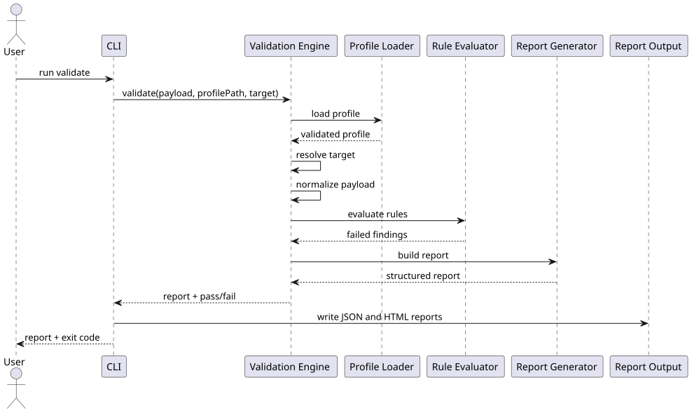

# Validation Engine Design

This document defines the validation engine responsibilities, inputs, outputs, and evaluation flow as implemented in the current repository.

## Responsibilities

- Load and validate a profile.
- Resolve the validation target from CLI input or profile metadata.
- Normalize VC or VP payloads into a target-scoped document.
- Evaluate profile rules deterministically.
- Produce a structured validation report.

## Inputs

| Input | Description |
| --- | --- |
| `profile_path` | Path to a YAML profile definition validated against `profile-schema.json` |
| `payload` | Decoded VC or VP payload object |
| `target` | Optional target override: `vc` or `vp` |
| `input_source` | Optional input source string recorded in report metadata |
| `input_sha256` | Optional SHA-256 value recorded in report metadata |

Note: JWT and JSON parsing are performed by the CLI before invoking the validation engine.

## Outputs

| Output | Description |
| --- | --- |
| `report` | Structured report object containing profile metadata, findings, summary, and execution metadata |
| `passed` | Boolean value derived from the report summary result |

The CLI maps engine outcomes to process exit codes:

| Exit Code | Meaning |
| --- | --- |
| `0` | Validation passed |
| `1` | Validation completed and produced failing results |
| `2` | Execution error, invalid input, or invalid configuration |

## High-Level Flow

1. Load the selected profile and validate it against the profile schema.
2. Resolve the validation target (`vc` or `vp`) from the explicit target override or profile targets.
3. Normalize the decoded payload into a target-scoped document.
4. Evaluate rules in profile order.
5. Collect findings for failed rules only.
6. Build the structured report summary and metadata.
7. Return the report and pass/fail status to the CLI.

## Normalization

- The engine receives a decoded payload object.
- The engine wraps the payload under a root namespace for path resolution:
  - `$.vc` for VC payloads
  - `$.vp` for VP payloads
- If the target is unsupported, validation fails with an engine error.

## Evaluation Semantics

- Rule evaluation is deterministic and does not short-circuit across rules.
- Rules are evaluated in the order they appear in the profile.
- Array and wildcard matching use `any` semantics.
- Missing paths produce failed rule results for evaluators that require resolved values.
- Only failed rules produce findings in the final report.

## Failure Scenarios, Handler Module & Outcome

| Scenario | Module | Outcome |
| --- | --- | --- |
| Profile file is missing or cannot be loaded | Validation Engine | Raises a validation engine error |
| Profile schema validation fails | Validation Engine | Raises a validation engine error |
| Target cannot be resolved from the explicit override or profile metadata | Validation Engine | Raises a validation engine error |
| Unsupported target is passed to normalization | Validation Engine | Raises a validation engine error |
| Input cannot be parsed as JWT or JSON | CLI | Returns exit code `2` before invoking the engine |
| Unknown rule type reaches the evaluator | Schema Validation and Validation Engine | Normally blocked by schema validation; if encountered at runtime, treated as a failed rule |
